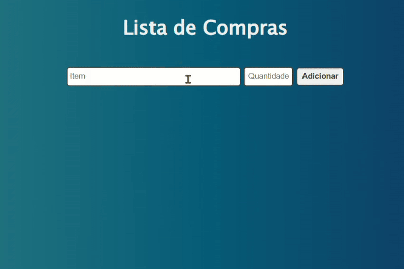

# Lista de Compras

  

### Sobre o Projeto
Este é um site simples de lista de compras, construído com HTML, CSS e JavaScript. Ele permite que o usuário adicione itens, marque-os como comprados, e os remova da lista.

### Funcionalidades
* Adicionar novos itens à lista.
* Marcar itens como comprados.
* Remover itens da lista.
* Interface intuitiva e limpa.

### Tecnologias Utilizadas
* HTML5
* CSS3
* JavaScript

### Como Usar
1.  Clone este repositório para o seu computador.
2.  Abra o arquivo `index.html` em seu navegador.

### Autor
* **Nome:** Franciele Sampaio
* **GitHub:** https://github.com/fsampaio486
